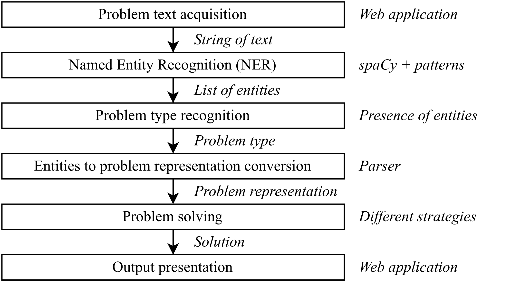
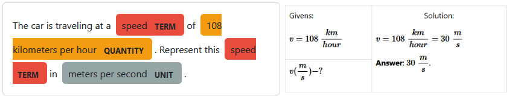
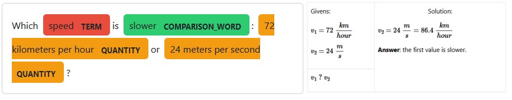
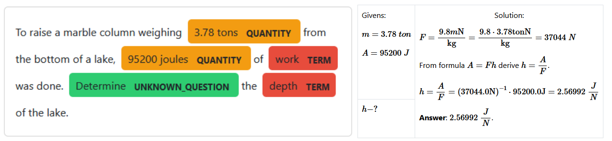
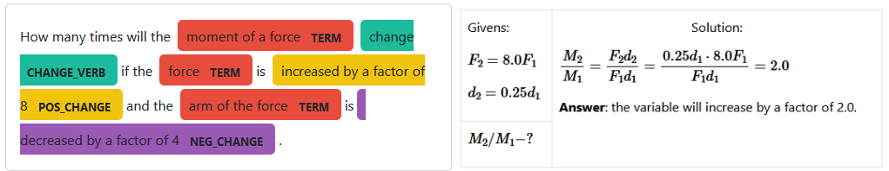

# Title
Automatic solving of physics word problems

# Authors
- Ruslan Popov
- Nadiia Karpenko

# University
Faculty of Physics, Electronics and Computer Systems, Oles Honchar Dnipro National University, Haharina Ave, 72, Dnipro

# Abstract
We present a system that solves simple physics word problems (PWPs)
stated in the English language. PWP is an interesting subfield of word
problems that is not studied as deeply as math word problems (MWPs).
We described the process of analyzing English text, the representation
of problems, and algorithms for finding the solution. We have
researched the types of PWPs and described their problem-solving
strategies. We have noted the peculiarities that PWPs introduce in
comparison to MWPs. We discussed the capabilities and limitations of
our implementation and proposed future research areas.

# Keywords 
physics word problems, automatic problem solving,
artificial intelligence, natural language processing, natural language
understanding.

# Introduction

With the publication of Large Language Models (LLMs), students are
tempted to solve their school problems by using AIs such as ChatGPT,
Bard, etc. However, recent studies show that LLMs cannot solve physics
problems well [^@frust_soc]. Indeed, LLMs are neural models that try to
predict the next word of the answer probabilistically. Thus, neither
students nor engineers can trust the output of the model.

Solving word problems is a classic and challenging field of AI
programming. The automatic solving of such problems involves natural
language processing, a well-formed problem representation, and a good
problem-solving strategy.

In this paper, we want to study the automatic solving of physics word
problems.

There are several reasons for the relevance of our paper:

-   The field of word problem solving is very diverse, and its research
    has not developed as quickly as the research, for example, of neural
    networks.

-   A significant research gap exists in understanding how to solve word
    problems within specific scientific fields (such as physics,
    chemistry, etc.) , whereas MWP solving has been a well-established
    area of study.

-   Physics word problems bring new challenges in automatic solving that
    require specific techniques to overcome them.

-   While many arithmetic word problem data sets exist, there is no
    widely used collection of physics problems.

We want to revive the classic AI approach where programs solve human
problems in a correct and deterministic way, where programs utilize the
field knowledge, rules, and definitions to give a strict and accurate
answer.

# Literature analysis

## STUDENT: Pioneer AI program

The D. Bobrow's STUDENT program is one of the first AI programs to
understand natural language, showing promising results [^@student]. The
program solves algebraic word problems stated in English. An example of
the problem that STUDENT can handle:

> If the number of customers Tom gets is twice the square of 20% of the
> number of advertisements he runs, and the number of advertisements is
> 45, then what is the number of customers Tom gets?

The STUDENT approach is straightforward: the problem is represented as a
set of simultaneous equations; the solution of the problem is the
solution for that set. The program used pattern matching and kernel
sentence theory to transform English text into a set of equations. For
the example above, STUDENT would generate this system:

$$
\begin{cases}
        (CUSTOMERS) = 2 * (0.2 + (ADVERTISMENTS)) ^ 2 \\
        (ADVERTISMENTS) = 45 \\
        ? = (CUSTOMERS)
\end{cases}
$$

Words in the problem text resemble mathematical operations and
variables, so the STUDENT can translate the English text into
mathematical expressions using pattern matching. The question mark is a
special symbol used to denote the unknown value. The variables in the
equation are subparts of the problem text.

When the set of equations is unsolvable, the STUDENT will try to solve
it again with several techniques applied. For example, STUDENT may
change variable names to be equal if they have some words in common
(e.g., "*SPEED*" and "*SPEED OF THE CAR*"). Or, the STUDENT may add new
equations from its internal knowledge of the world.

The STUDENT program is nearly 60 years old. The field of AI programming
has improved since that time. Peter Norvig presented an analysis and
elegant implementation of STUDENT written in Common Lisp in functional
programming style [^@paip].

## Math word problem solvers

We want to continue the literature overview by analyzing math word
problem solvers. We want to inherit the researched knowledge of natural
language processing and problem representation that is studied in this
field of word problem-solving.

Here is the list and analysis of different problem representations for
MWPs structured by Mandal et al. [^@mwp_repr]:

-   Equation template representation. An equation template is a
    predetermined equation that is formed with arithmetic operations and
    with two types of unknowns (called slots): unknown variables and
    numbers. Using statistical approaches, the words in the problem are
    aligned into these unknown slots.

-   Equation tree representation. The whole problem is converted into an
    equation tree using statistical methods. Usually, recognizers
    generate several trees, so another approach is applied to choose the
    best.

-   Entity and state transition-based representation. In this approach,
    the problem consists of states and state transitions. A state
    contains all the information of the known objects (their owners,
    count, and type). State transition would change the count of
    belonging objects, which can result in an equation.

-   Tag-based representation. In this method, the text is processed in
    several stages. First, it is tokenized and parsed. Then, the type of
    problem is recognized. After that, several logic forms representing
    grammatical relations and quantities are generated. An answer is
    generated using special techniques.

The natural language processing of MWPs has many methods, including
rule-based techniques and statistical and neural models. Often, solvers
parse the English text into dependency trees. Common features extracted
from the text are part of speech tag, the lemma of a word, quantities,
units of quantities, comparative adverbs, dependencies between verbs and
quantities, etc. [^@mwp_nlp].

## Physics word problem solvers

There is not so much research and categorization on PWP solvers. Most
programs date back to 1970-1980 and use their own knowledge
representation and custom natural language processing methods.

One of the first programs that could handle PWP is the NEWTON program by
Kleer [^@newton]. It is made to solve mechanical problems. NEWTON would
analyze the programs text and convert it to several data structures. The
first data structure depicts objects, and the second is a tree-like data
structure (called "envisioning tree") that holds all possible states of
the objects. The trees root is the starting position, and the next
children are the next events. When the tree divides, it means that there
are several possibilities where an object could move. Quantitative
knowledge is presented in a data structure called FRAME. It stores all
the known parameters of the object and the equations that connect those
parameters.

Gordon S. Novak Jr. has studied the topic of physics problems very
thoroughly. One of the programs he developed is ISAAC [^@isaac]. This
problem understands and solves physics problems that involve rigid
bodies in static equilibrium. The program can also draw a diagram of the
problem.

ISAAC problem analysis consists of lots of stages, and they have several
branches. Firstly, an augmented transition network transforms the
English text into structured parsed sentences. Then, the semantic
analysis is performed. It is used to determine the meaning of verbs and
prepositions. After several stages, a canonical object model is formed.
In this data structure, objects in the problem are represented as
physics objects (point, pivot, lever, etc.). The canonical object model
is then passed to the EUCLID program, which analyzes the orientation of
objects and assigns coordinates to them. After that, the geometric model
is formed. Problem-solving involves creating a set of equations that
represent physical laws between objects.

The ISAAC program is big and complex. It is hard to analyze it because
of its age and programming style. As the author states, 44 pages of Lisp
code is written only for parsing the English text, while problem-solving
is one of the simplest parts of the program. We were unable to find the
source code of the ISAAC program.

Bundy et al. created the MECHO program, which addresses mechanical PWPs
and is implemented in Prolog [^@mecho]. The program processes the word
problem in several stages. First, it parses the text, extracting
information. Then, MECHO derives assertions related to objects, given
parameters, and unknown values from the parsed data. These assertions
are then transformed into a particular data structure called schema,
where inference rules, resembling logical representations of physics
laws in Prolog, are applied. MECHO can provide either symbolic or
numerical solutions.

Mukherjee et al. have an extensive overview of rule-based word problem
solvers and a dedicated section for PWPs. Other programs for solving
PWPs include BEATRIX, ALBERT, and FREEBODY [^@other_pwp]. All those
programs address only specific types of physics problems. As the reader
may notice, all the names of the programs resemble human names and are
written in upper-case. Possibly, this tradition came after the STUDENT
program.

We have found a modern paper on PWP solving. Leszczynski et al. address
the problems of a free-falling object under constant acceleration of
gravity [^@modern_pwp]. The problem is analyzed using several recurrent
neural networks (RNN), then the dynamical system is formed, and the
solution is provided at the end. The first RNN is a word labeler used to
extract the given values and the problem question. The second RNN is a
classifier that determines the type of question. While this work seems
modern and interesting, the accepted problem set is limited and
generated artificially using context-free grammar.

## Conclusions of literature analysis

We have investigated the design of several word problem solvers.
Unfortunately, we concluded that a few techniques apply to make a
generic PWP solver. Or at least the known methods cannot solve problems
from Ukrainian physics textbooks.

There are some issues in using STUDENT to solve physics problems.
Consider the problem: "*If the distance between Dnipro and Kyiv is 477
kilometers and the time the automobile has traveled is 6 hours, then
what is the speed of the automobile?*". The STUDENT would generate this
set of equations:

$$
\begin{cases}
        (DISTANCE) = 477 kilometers \\
        (TIME) = 6 hours \\
        ? = (SPEED)
\end{cases}
$$

As the reader may notice, the STUDENT has generated a system consisting
of given values and unknowns. This set would resemble the column
"Given", which is usually written by students. But the physics problem
cannot be represented like this set of equations for two reasons:

1.  This set is unsolvable. A set of equations requires that all the
    information needed to find the unknowns is present in the set. But
    our example has no connection between speed, time, and distance.

2.  There is a theoretical issue. In math, variables represent unknown
    values and act like bound variables in lambda calculus: their names
    can be changed freely unless they interfere with another name. But
    in the physics field, the name of variables has a special meaning.
    It is a given value that marks some parameter of an object.

In this example, STUDENT would add needed equations from its internal
knowledge using the search on the first word of a variable (it may find
the relation "*the distance is equal to time multiplied by speed*").
While this approach may work for simple problems like the one above, it
is not the best solution because it is too chaotic and brute-force-like.

The approaches presented in subsection 2.2 are not sufficient to
represent physics problems. They are constructed around math
expressions, though in PWP, usually there are no explicitly stated
expressions (only given values are specified).

Most papers for word problem-solving are outdated. They use
unstandardized programming languages with undefined styles of
programming. The analysis of the capabilities and limitations of
previous works is not enough.

# Object, subject, and methods of research

## Object and subject

The object of our research is automatic word problem-solving. The
subject of our research is the automatic solving of physics word
problems.

## Method of the research

To study the subject, we developed a program that can solve basic PWPs
stated in the English language, which do not involve any dynamic change
or complex representation. Also, we do not support solving problems
where a graphical model is needed (forces, impulses, energy, etc.).

The whole program was written in Python language. We have separated our
program into two projects: one is a user interface, and the other is the
core library. The technology stack of the user interface consists of
Django (web framework), MathJax (LATEX output), and Bootstrap (graphical
design). The library uses spaCy (natural language processing) and SymPy
(symbolic math) libraries. We used PythonAnywhere to host our program
(<https://inanyan.pythonanywhere.com/>).

By definitions provided in AI:MA [^@aima], we consider our program to be
inside the "Thinking Rationally" field because we are trying to find the
computational model behind PWP solving and provide the user with a
correct problem solution.

The whole NLP pipeline, algorithms, and data structures that are used by
our program can be depicted through this diagram:

<p align="center">
  
</p>
<p align="center">
  Figure 1: Algorithms and data structures of our program.
</p>

In fig. 1 nodes represent algorithms, right after the node comes a brief
comment on the chosen approach, and the labels of the arrows are data
structures. In section IV of the paper, we will describe all the steps
of the program, but before that, we will discuss the found types of
physics problems to understand what features we need to extract from
English text.

## Testing data

To test our program, we created a small dataset with physics problems
collected from various sources such as [^@ukr_ph_1], [^@ukr_ph_2], and the
Internet. We translated the Ukrainian variants to English.

# Description of the program

## Problem types

The first thing we did before starting to make this program was to study
available PWP. We noticed that PWPs fall into five categories:

-   Theoretical problem: "*Why do we not observe the daily rotation of
    the earth in everyday life?*".

-   Value conversion problem: "*The car is traveling at a speed of 108
    kilometers per hour. Represent this speed in meters per second*".

-   Value comparison problem: "*Which speed is bigger: 10 meters per
    second or 10 kilometers per hour?*".

-   Unknowns finding problem: "*The car drove for 40 minutes at a speed
    of 144 kilometers per hour. How far did the car travel?*".

-   Calculation of the change of a value depending on other value
    changes: "*How many times will the speed of wave propagation
    increase if the wavelength increases by three times and the period
    of oscillation remains unchanged?*".

We decided not to solve the theoretical problems because they require an
extensive ontology of physics definitions and laws, while we were more
focused on computational problems.

## Named Entity Recognition

We chose the named entity recognition (NER) method for the feature
extraction task. In this method, subparts of text, called entities, are
marked with a particular string that represents the type of an entity.

We have collected the information about which entities our program
should recognize:

-   Given values: "*the distance is 10 kilometers*", "*the mass is 50
    grams*", etc.

-   Unknown values: "*What is the speed...*", "*Determine the density
    of...*", etc.

-   Units: "*meters per second*", "*kilogram*", "*Newton*", etc.

-   Value changes: "*time is increased by a factor of 2*", etc.

For NER, we chose a rule-based method -- pattern matching. We will
present the patterns we used for NER with our modified BNF notation
because there is no standardized way to do this. In this notation, no
recursion is allowed. Terminals are written as is and may resemble
either the lowercase form of a token or its lemma. Non-terminals are
written inside '<' and '>'. Entities are written as non-terminals
whose names are written in uppercase form; the other non-terminals are
fragments used only for easier construction of the grammar. The special
rule <like_num> denotes one token resembling a number. An ellipsis
indicates a part of the rule that was shortened in the paper.

Here is the list of all the rules:

```ebnf
<unit_name> ::= meter | hour | kilogram | candela | lux | ...

<modifier> ::= cubic | square

<single_unit> ::= [<modifier>] <unit_name>

<compound_unit> ::= <single_unit> per <single_unit>

<UNIT> ::= <single_unit> | <compound_unit>

<QUANTITY> ::= <like_num> <UNIT>

<COMPARISON_WORD> ::= greater | faster | bigger | larger | slower| less | ...

<single_term> ::= density | volume | speed | length | moment | force | ...

<compound_term> ::= ampere force | wave propagation | ...

<simple_term> ::= <single_term> | <compound_term>

<of_term> ::= <simple_term> of [<determiner>] <simple_term>

<TERM> ::= <simple_term> | <of_term>

<UNKNOWN_QUESTION> ::= what | determine | calculate

<special_unknown_word> ::= far | fast | often

<UNKNOWN_HOW_QUESTION> ::= how <special_unknown_word>

<neg_change_word> ::= decrease | reduce

<pos_change_word> ::= increase

<determiner> ::= a | an | the

<change_pattern> ::= by [<determiner> factor of] <like_num>

<NEG_CHANGE> ::= <neg_change_word> <change_pattern>

<POS_CHANGE> ::= <pos_change_word> <change_pattern>

<CHANGE_VERB> ::= <pos_change_word> | <neg_change_word> | change
```

We provide here an example of NER to understand this process better:

<p align="center">
  
</p>
<p align="center">
  Figure 2: Example of named entity recognition for an unknown finding problem.
</p>

<p align="center">
  
</p>
<p align="center">
  Figure 3: Example of named entity recognition for a value change problem.
</p>

## Problem type recognition

The program determines the type of problem by looking at the presence of
entities. The algorithm can be described in English like this:

1.  If there is a CHANGE_VERB entity, then it is a value change problem.

2.  If there is a UNIT entity, then it is a conversion problem.

3.  If there is a COMPARSON_WORD entity, then it is a comparison
    problem.

4.  If there is an UNKNOWN_QUESTION or UNKNOWN_HOW_QUESTION entity, then
    it is an unknown finding problem.

5.  Otherwise, the program cannot recognize the type of problem.

## Entities to problem representation conversion

The algorithm for converting a list of entities to problem
representation according to the recognized problem type can be described
like this:

1.  For value conversion problem, extract a quantity and a unit.

2.  For value comparison problems, extract two quantities.

3.  For unknowns finding problem, extract given and unknown values.

4.  For value change problems, extract the value changes and the value
    in question.

To convert a quantity into the internal math representation, the program
converts the number (the first token) and the unit (the rest).

We have found that units in SymPy are written as regular English words,
allowing us to use Python's insecure "eval" function. The program will
convert the unit entity into a valid Python expression and call the
"eval" function. We replace the word "*per*" with the division symbol.
To parse the modifiers "*square*" and "*cube*", we replace those words
with "**2" and "**3", respectively, after the single unit.

We have found two ways in which given values are encoded in the list of
entities. It is either a pair of TERM and QUANTITY or a single QUANTITY.

To convert the pair of TERM and QUANTITY into a given value, the program
needs to convert the term into a symbol (the QUANTITY will be the value
of a given variable). The program uses a hard-coded map data structure,
the key to which is a string, and the value is a symbol (e.g., "*force*"
is $F$, "*mass*" is $m$, etc.).

A special technique for determining the symbol should be applied to
convert a single QUANTITY into a given value. We have found that looking
at the unit of a quantity can infer the variable. If the unit is one
English word, the program uses a hard-coded map data structure (e.g.,
"*meters*" is $S$, "*seconds*" is $t$, etc.).

The conversion of compound units and units with modifiers is tricky.
However, we noticed that compound units resemble a physical formula
(e.g., "*meters per second*" corresponds to $v = frac{S}{t}$, etc.).
So, the program will first convert all one-word units in the compound
unit to the symbols. Then, if the expression is not a single unit, the
program will search the list of formulas for a formula, the right-hand
side of which is identical to the result expression.

The whole process described above ended up being so powerful that the
program will use it while presenting the output of value comparison and
conversion problems.

Unknown values are encoded either as a pair of UNKNOWN_QUESTION and TERM
or as a single UNKNOWN_HOW_QUESTION. For the first variant, it is
sufficient to convert the TERM into a variable, and for the second
variant, we use a hard-coded map data structure (e.g., "*how far*" is
$S$, "*how fast*" is $upsilon$, etc.).

Value changes are encoded as a pair of TERM and POS_CHANGE or TERM and
NEG_CHANGE. To convert these pairs into a variable change, the program
should infer the variable by the TERM entity and determine the factor of
the variable change. According to our NER rules, the factor number comes
at the end of the POS_CHANGE and NEG_CHANGE. So, it is enough to parse
the last token in the span. If the entity is NEG_CHANGE, the parser
should also take the numbers reciprocal.

The value under change is encoded as a pair of TERM and CHANGE_WORD. It
is enough to infer the variable from the TERM entity.

## Problem-solving

Solving value conversion and comparison problems is trivial, and it is a
primitive operation in the SymPy library, so we will not describe these
processes. However, we note that for value comparison problems, the
program will convert the second value to the unit of the first value.

We define the solution to unknowns finding problems as a list of
formulas. This list resembles a plan of actions that the computer should
perform. The calculation of the final answer is delegated to the output
part of our program.

The first attempt to solve an unknown finding problem would be to use a
search algorithm for each unknown variable to find a formula left-hand
side of which is equal to the unknown. But this approach is wrong for
several reasons:

-   The program could find several applicable formulas for one unknown.

-   The formula may contain an unknown variable (a variable that is not
    given). However, it is possible to find another formula that could
    be used to find those variables.

-   One physical formula can be used to find several variables. Consider
    the second Newton's law: $F = ma$. This formula can be used not only
    to find a force but also a mass (if the force and the acceleration
    are known) or an acceleration (if the force and the mass are known).

These discussions guided us to make this recursive algorithm:

1.  Find an applicable formula for the unknown variable.

2.  Create a set difference of given variables and the free symbols in
    the found formula. This set will resemble the set of unknowns of a
    formula.

3.  If the set is empty, return a list of one element containing the
    found formula (base case).

4.  Otherwise, perform these steps:

    1.  For each element in the set, apply this algorithm (recursive
        step).

    2.  Combine all the results. The final result is a list.

    3.  Append the found formula to the list.

    4.  Return the list.

We described this algorithm informally because the algorithm can fail in
several steps. If the algorithm fails on step 1 or step 4.1, this may
mean two things: the program cannot find the solution for the unknown
variable in the problem representation, or the program should find
another formula to apply.

Also, we used the term "applicable formula". This means the formula
belongs to the internal list of formulas or is derived.

We have quickly noticed that this algorithm is a simplified version of
the Stanford Research Institute Problem Solver algorithm [^@strips]. So,
we modified it to the physical field. The goals are represented as math
symbols. The operators are the applicable formulas. The preconditions of
an operator (or a formula) are the free symbols of the formula. The
initial step is represented as a set of given.

We define the solution to a value change problem as an ordered pair of a
floating-point number and a formula. The number is the result of
dividing the value of a changed value and the original value, and the
formula is used to present the output for the user.

We invented this problem-solving algorithm for this problem type:

1.  Find a formula for which the given variables are a subset of the
    formula's variables.

2.  Substitute each formula variable with the given variables as a
    "factor * variable".

3.  Divide the derived formula with the original formula.

4.  If the result is a number, then it is the answer to the problem.

5.  Otherwise, repeat from step #1 and find another formula.

The algorithm may fail at step 1 or 5, meaning the program could not
find the formula to calculate the change. The algorithm is simple, and
it resembles human thinking.

## Context

The first time we made a prototype of the program, we noticed it was
limited. Consider a problem: "*What is the optical power of a converging
lens with a focal length of 40 centimeters?*". A special formula solves
this problem ($D = pm frac{1}{F}$). However, the formula varies
whether the lens is a converging lens or a diverging lens. Another
situation when we find this peculiarity is when we need to calculate the
surface of an object (squares, rectangles, triangles, etc.).

We introduce the term context to encode the information about a physical
object. Context is a set of strings that encode objects and their
qualities. Examples of context words: "*lens*", "*converging*",
"*diverging*", "*square*", "*cube*", "*rectangle*", etc. In each physics
problem, there is an associated context.

# Results

## Examples of program usage

We will present the solution of 4 problems with different types and
comment on how the program solved them.

Problem #1: "*The car is traveling at a speed of 108 kilometers per
hour. Represent this speed in meters per second*".

<p align="center">
  
</p>
<p align="center">
  Figure 4: The program results for problem #1.
</p>

Problem #1 is a conversion problem. We haven't found many problems of
this type. The program correctly recognized the given quantity and
target unit. There is no detailed explanation of the solution because
conversion is a primitive operation in SymPy.

Problem #2: "*Which speed is slower: 72 kilometers per hour or 24 meters
per second?*".

<p align="center">
  
</p>
<p align="center">
  Figure 5: The program results for problem #2.
</p>

Problem #2 is a comparison problem. It is not trivial to compare
$72frac{km}{h}$ and $24frac{m}{s}$. The program correctly recognized
two quantities and the type of the problem. According to our
problem-solving strategy, the program converted the second value to the
unit of the first value. Also, our program generates answers based on
the word that was asked. For example, if the question asks for greater
value, the answer will show greater value, and in this example, the
program tells us about slower value.

Problem #3: "*To raise a marble column weighing 3.78 tons from the
bottom of a lake, 95200 joules of work was done. Determine the depth of
the lake*".

<p align="center">
  
</p>
<p align="center">
  Figure 7: The program results for problem #3.
</p>

Problem #3 is an unknown finding problem. We chose this problem because
it is not so trivial to solve; it includes several formulas for the
solution. Unfortunately, this example shows some peculiarities of SymPy
and our implementation, which we will discuss in the following
subsection.

The program correctly recognized the given variables and the unknown
variable. The program correctly found the solution, including the
gravitational force and work formulas. Additionally, the program derived
the height from the work formula.

Problem #4: "*How many times will the moment of a force change if the
force is increased by a factor of 8 and the arm of the force is
decreased by a factor of 4?*".

<p align="center">
  
</p>
<p align="center">
  Figure 7: The program results for problem #4.
</p>

Problem #4 is a value change problem. A parser is needed to convert the
list of entities to the problem representation fully. The program
correctly recognized the given changes and the value under question. The
program found the required formula and performed a substitution, which
resulted in a number.

Special attention is required to the term entities. We included the
preposition "*of*" in the term. Usually, while recognizing noun phrases
(NP), different NPs stay away, but we combined them and determined the
variable based on the first words. If we did not make this decision, an
ambiguity would arise: do we need to find the change of the moment or
the force?

## Analysis of limitations of the program

We performed a thorough analysis of issues that our program has. We
grouped the issues into several categories:

1.  Complex problem types.

2.  Imperfect natural language processing.

3.  Inaccurate problem type recognition.

4.  Incomplete problem representation.

5.  Imperfect problem-solving techniques.

6.  Symbol is semantically equal to terms and objects.

7.  Issues with libraries that we use.

We want to begin the analysis of the limitations of our program by
analyzing our problem-type classification. We have found that our types
can have new subtypes. Consider the problem: "*Can a wedding ring with a
volume of 0.5 cubic centimeters and a mass of 8 grams really be gold?*".
It is a new question type for which the answer is a Boolean value. But
it is easy to notice that this is a subtype of unknown finding problem.
The program must compare the object's density to the actual gold
density.

There are lots of issues with natural language processing. We have found
that the solution to the problem depends highly on the problem
formulation. A possible reason is that we used a rule-based approach for
NER. Rule-based techniques are usually used on the first iteration of
NLP program development, and then they are replaced by more powerful
statistical or neural models [^@nlp].

Pattern matching, used for NER, restricts the input text to a specific
syntax. For example, we require that the units are written as proper
English words instead of their abbreviations. The program cannot
recognize numbers that are not written with decimal notation (e.g.,
"*one second*"). The patterns require that every quantity has a
corresponding unit (the program cannot parse "*1 and 4 kilograms*" as
two quantities). Change of a value should be written as "*increased by
9*" or "*reduced by a factor of 2*" (but the program cannot parse "*the
value is halved*" or "*doubled*"). There are many ways to formulate the
problem, so there could be lots of patterns in the text that the
programmer may miss.

Another interesting problem that our application has is that it cannot
support tasks with named constants. The program cannot infer that the
"*length of the equator*" is about $4 cdot 10^{4}, km$. Also consider
the problem: "*Find the volume of mercury weighing 2 kilograms*". The
program needs to refer to the table of densities and update the problem
representation. Our implementation does not do it.

The most interesting issue with parsing English text is that it is easy
to deceive the program. Consider the problem: "*The airplane flew 1200
kilometers in 2 hours. At what speed did the airplane fly?*". The
program can handle it. But if the user adds this sentence to the end of
the text: "*Represent the result in meters per second*", then our
implementation will think that this problem is a value conversion
problem. So, looking at keywords is not the best approach to determine
the type of problem.

Our problem representation is too basic. The physics problem is not a
set of given variables and unknowns. An image or a diagram may be
included, but the program cannot analyze them. An equation may be
offered.

However, one of the biggest issues with problem representation is that
we do not support several objects in the task. The program cannot
recognize the two velocities of two bodies or two capacitors capacitance
values in an electric chain. The problem lies in the representation of
variables; we use only one symbol for them, but an index could also be
used in the real world.

The solution to some problem types may be more complicated than we
provide. This can be illustrated by this problem: "*The masses of two
steel balls are 1 kilogram and 4 kilograms. Which of the balls has the
greater volume? By how many times?*". Again, it is a simple problem for
a human to solve, but not the computer. Our program would think this is
a comparison problem and happily answer that 4 kilograms is bigger
than 1. The program should use a formula for inferring the volume of
objects, but our implementation handles only the given quantities.

Our problem-solving strategy for value change problems is imperfect. We
defined that the answer to a value change problem results from division.
But we can compare values not only with division but also with
subtraction. Also, we implicitly assume that the physical formulas are
created with multiplication and division of variables so that the
variables will be reduced in the division step. But if the formula is
formed with addition, then this strategy will not work.

Consider the problem: "*How would the mass of an iron ball change if its
radius is increased by a factor of two?*". This problem requires two
formulas to find (one for the volume and one that involves the density
of iron). It is easy to notice that we can reuse the STRIPS algorithm to
find the unknowns of the first formula, but there lies a new degree of
complexity.

We propose a hypothesis that it is impossible to construct an efficient
algorithm for solving value change problems. For every unknown variable
in the formula, the program should decide whether to leave it as is
(hoping it will be reduced in the division) or to find another formula.
But that second formula could also have unknown variables. Moreover, it
may miss some changes if the program doesn't use a formula for some
unknowns.

There is a theoretical issue with our program. Our problem-solving
algorithm treats physical terms and objects as variables. But, in the
real world, variables resemble physical terms. With this issue, an
ambiguity arises: $c$ may mean either capacitance or speed of light, but
the program considers these terms equal because they are written with
the same symbol.

We have used a special technique for treating a QUANTITY entity as a
given value if there is no TERM entity. If the program encounters a "*2
meters*"" entity, it will treat it as $S = 2 m$. We have found that
this is another ambiguity in our implementation. This entity can be not
only $S$, but also $l$, $h$, $d$, etc.

There are also various issues with the libraries we use. The SymPy
treats the unit of a physical value as a variable, so problems with
printing may arise. Another problem is that SymPy does not know that
Joule divided by Newton is a meter. Not enough units are provided in the
SymPy library. The library documentation is too short, and we have not
found a simple way to resolve these issues.

# Conclusions

In this paper, we have studied the automatic solving of physics word
problems. PWP solving is a challenging subfield of word problem solving
that requires complex problem representation. We have found that
researched solutions for math word problems are unsuitable for solving
PWP. Current PWP solvers are focused on specific problem types, while we
were interested in generic PWP solvers.

To study our papers object and subject, we developed and described a
program that could solve simple physics problems. Our testing dataset
was formed from Ukrainian physics textbooks. The development of word
problem solvers focuses mainly on problem representation, natural
language processing, and problem-solving strategies.

Our analysis shows that PWPs fall into five categories: theoretical,
value conversion, value comparison, unknowns finding, and value change
problems.

To convert problem text into the internal problem representation, we
chose named entity recognition based on pattern matching. Other
techniques for NER besides pattern matching on tokens can be used to
analyze problem text, such as pattern matching on trees and statistical
and neural models. Problem types are recognized based on the presence of
particular entities. While this approach was sufficient on our small
dataset, we have noticed that this solution could be easily broken.
After NER, another step is required to convert a list of entities into
the representation.

We have found a new kind of ambiguity: "quantity without a term". This
type of ambiguity occurs when the program finds a quantity entity that
is a given value, but the program cannot infer the variable for this
quantity. We partially solved this problem by inferring the variable by
the unit of the quantity.

Our research shows that the algorithm for solving problems with unknown
values is the STRIPS algorithm. Value change problems are complex
problems to solve because of many non-trivial parameters. We hypothesize
that these problems cannot be solved efficiently and belong to the class
of "NP-hard" problems.

While our program can solve static computational physics problems, it is
obvious that there are many other types of physics problems. Our program
can be improved by choosing different NLP methods and by developing a
more sophisticated problem representation.

# References
[^@nlp]: B., S. V., B. Majumder, A. Gupta, and H. Surana. 2020. *Practical
Natural Language Processing: A Comprehensive Guide to Building
Real-World NLP Systems*. O’Reilly Media.

[^@student]: Bobrow, D. 1964. “Natural Language Input for a Computer Problem Solving
System.” In *Semantic Information Processing*, 146–226. Cambridge, MA:
USA:MIT Press.

[^@mecho]: Bundy, A., L. Byrd, G. Luger, C. Mellish, R. Milne, and M. Palmer. 1979.
“MECHO: A Program to Solve Mechanics Problems.” *Department of
Artificial Intelligence, University of Edinburgh*.
https://doi.org/<http://www.worldcat.org/title/mecho-a-program-to-solve-mechanics-problems/oclc/475999217.>

[^@strips]: Fikes, R. E., and N. J. Nilsson. 1971. “Strips: A New Approach to the
Application of Theorem Proving to Problem Solving.” *Artificial
Intelligence* 2 (3): 189–208.
<https://doi.org/10.1016/0004-3702(71)90010-5>.

[^@frust_soc]: Gregorcic, B., and A.-M. Pendrill. 2023. “ChatGPT and the Frustrated
Socrates.” *Physics Education* 58 (3): 035021.
<https://doi.org/10.1088/1361-6552/acc299>.

[^@mecho]: Kleer, J. 1977. “Multiples Representations of Knowledge in a Mechanics
Problem-Solver.” In *Proceedings of the 5th International Joint
Conference on Artificial Intelligence*, 1:299–304. USA. San Francisco,
CA, USA: Morgan Kaufmann Publishers Inc.
<https://doi.org/10.1016/B978-1-4832-1447-4.50009-2>.

[^@modern_pwp]: Leszczynski, Megan, and José E. Moreira. 2017. “Machine Solver for
Physics Word Problems.” In.
<https://api.semanticscholar.org/CorpusID:58605280>.

[^@mwp_repr]: Mandal, S., and S. K. Naskar. 2019. “Solving Arithmetic Mathematical
Word Problems: A Review and Recent Advancements.” Edited by P. Chandra,
D. Giri, F. Li, S. Kar, and D. K. Jana. *Information Technology and
Applied Mathematics*, 95–114.
<https://doi.org/10.1007/978-981-10-7590-2_7>.

[^@other_pwp]: Mukherjee, A., and U. Garain. 2008. “A Review of Methods for Automatic
Understanding of Natural Language Mathematical Problems.” *Artificial
Intelligence Review* 29 (2): 93–122.
<https://doi.org/10.1007/s10462-009-9110-0>.

[^@paip]: Norvig. 1991. *Paradigms of Artificial Intelligence Programming: Case
Studies in Common Lisp*. 1st ed. Morgan Kaufmann.
<https://unglueit-files.s3.amazonaws.com/ebf/59f74a93bbc1435c9ca1557b4bb6e9ba.pdf>.

[^@isaac]: Novak, G. S., Jr. 1976. “Computer Understanding of Physics Problems
Stated in Natural Language.” *American Journal of Computational
Linguistics*. <https://aclanthology.org/J76-3005.>

[^@spacy_rules]: “Rule-Based Matching Spacy Usage Documentation.” n.d.
<https://spacy.io/usage/rule-based-matching>.

[^@aima]: Russell, S., and P. Norvig. 2009. *Artificial Intelligence: A Modern
Approach*. 3rd ed. USA: Prentice Hall Press.
<https://people.engr.tamu.edu/guni/csce421/files/AI_Russell_Norvig.pdf>.

[^@mwp_nlp]: Zhang, Dongxiang, Lei Wang, Luming Zhang, Bing Tian Dai, and Heng Tao
Shen. 2020. “The Gap of Semantic Parsing: A Survey on Automatic Math
Word Problem Solvers.” *IEEE Transactions on Pattern Analysis and
Machine Intelligence* 42 (9): 2287–2305.
<https://doi.org/10.1109/TPAMI.2019.2914054>.

[^@ukr_ph_1]: Гельфгат, І. 2009. *Фізика. 7 Клас: Збірник Задач*. 4th ed. Веста.

[^@ukr_ph_2]: Ненашев, І. 2011. *Фізика. 8 Клас: Збірник Задач*. 5th ed. Веста.
